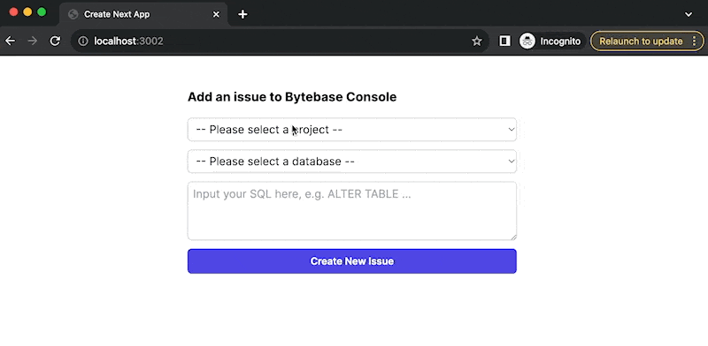

# Bytebase API Example

1. [Create an Issue](#create-an-issue)
1. [Check the Permission](#check-the-permission)

## Create an Issue

Corresponding [tutorial 🔗](https://www.bytebase.com/docs/tutorials/api/).

This is a sample app demonstrating how to use [Bytebase](https://github.com/bytebase/bytebase) API to create and rollout a database change.

Say your organization already has a DevOps platform and you want to integrate the database change into the development workflow. This app is for you.

The app is built with Next.js and TailwindCSS.



## Prerequisites

- Node >= 18

## Getting Started

### Step 1 - Start Bytebase

1. Check out [Self-host Bytebase via docker](https://www.bytebase.com/docs/get-started/self-host/#docker) for more information.
1. Create a [service account](https://www.bytebase.com/docs/how-to/spanner/how-to-create-a-service-account-for-bytebase/).
   Choose the `DBA` role which is sufficient for this sample.


1. Record the service account key.


### Step 2 - Configure and run this app

1. Clone this repository.
1. Copy `env-template.local` to `.env.local`.

   ```bash
   cp env-template.local .env.local
   ```

1. Update the env file with the created service account.

   - `NEXT_PUBLIC_BB_HOST`. The host where Bytebase is running. This usually is the [external url](https://www.bytebase.com/docs/get-started/install/external-url).
   - `NEXT_PUBLIC_BB_SERVICE_ACCOUNT`. The service account created in step 1.
   - `NEXT_PUBLIC_BB_SERVICE_KEY`. The service key created in step 1.

1. Run the following commands:

   ```bash
   pnpm i && pnpm dev
   ```

Open the host with your browser to see the running app.

## API Usage

API Doc: https://github.com/bytebase/bytebase/blob/main/proto/gen/grpc-doc/v1/README.md

### Fetch data

In `src/app/page.tsx`:

- List all projects
  `/v1/projects`

- List all databases
  `/v1/instances/-/databases`

### Create an issue

In `src/app/components/add-issue-form.tsx` and `src/app/api/xxxx/route.ts`:

In order to create an issue, you need to create resources **in the following order**:

1. Create a [sheet](https://github.com/bytebase/bytebase/blob/main/proto/gen/grpc-doc/v1/README.md#bytebase-v1-sheet)
1. Create a [plan](https://github.com/bytebase/bytebase/blob/main/proto/gen/grpc-doc/v1/README.md#bytebase-v1-Plan)
1. Create an [issue](https://github.com/bytebase/bytebase/blob/main/proto/gen/grpc-doc/v1/README.md#bytebase-v1-Issue)
1. Create a [rollout](https://github.com/bytebase/bytebase/blob/main/proto/gen/grpc-doc/v1/README.md#bytebase-v1-Rollout)

### Fetch issue status

In `src/app/components/add-issue-form.tsx`:

- Get issue by id `/v1/projects/{project}/issues/{issue}`

### SQL Check
added 2024/8/15, which is not included in the tutorial

## Check the Permission

This is a sample app demonstrating how to use [Bytebase](https://github.com/bytebase/bytebase) API to check which users have a specific database permission.


To be continued...